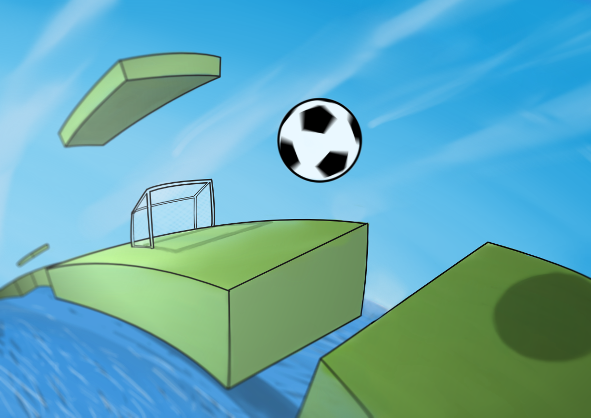

Roady Ball is inspired by an 80s PC game whose name I can't remember! Although the graphics are certainly very different from the original, the principle of the game should be the same: jump a ball and avoid the traps so you don't fall into the void! 

### Releases

#### Version 2.0
- New UI
- The game is now compatible with the latest iOs versions.
- Addition of road lights to see when it gets dark in the game.
- Bounciness of the ball is more realistic.

#### Version 1.0
- Initial version